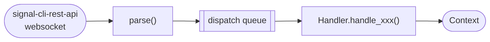
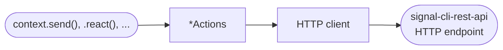
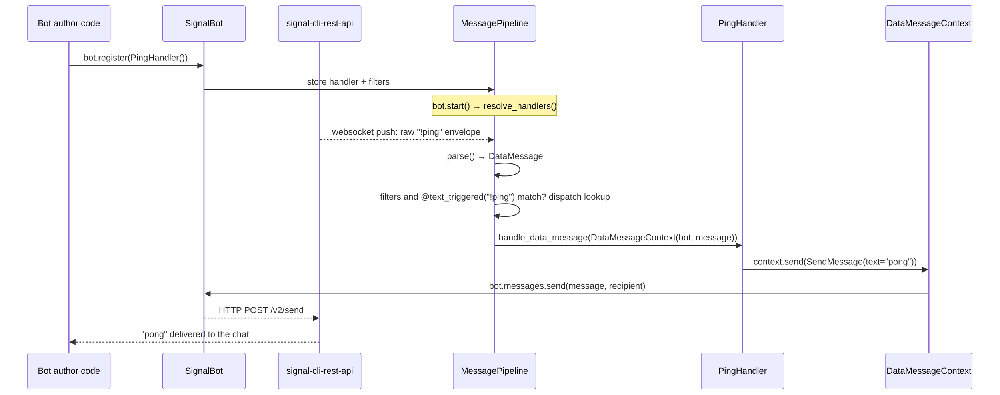

Signalbot moves messages in two directions: **incoming** messages arrive over a websocket and are
routed to your code, **outgoing** messages are sent by your code through an HTTP API. This page
shows how the pieces fit together.

## Architecture

### Incoming



### Outgoing



- **Incoming**: The internal pipeline reads the websocket, an internal `parse()` turns the raw JSON into a
  [`ReceivedMessage`][signalbot.messages.ReceivedMessage], dispatches it to the matching
  `Handler` and [`Context`][signalbot.context.Context] subclass before
  your `handle_xxx` method runs.
- **Outgoing**: calling a method on `context` (or directly on `bot.messages` / `bot.reactions` /
  ...) resolves the recipient, builds a request object, and sends it through an internal HTTP client to `signal-cli-rest-api`.

## Registration

Before any of this runs, handlers need to be registered with the bot — typically once at startup,
e.g. `bot.register(PingHandler())`. The `bot.register()` just stores the handler and its filters;
nothing is invoked yet. From then on, every incoming message is checked against each registered
handler's filters and trigger decorator (`@text_triggered`, `@regex_triggered`,
`@reaction_triggered`), and every handler that matches is invoked with a fresh `Context`.
Registration is the opening step of the walk-through below (steps 1-2).

### Exclusive handlers

By default every matching handler runs, so a handler without a trigger sees every message, also
the ones another handler already answered. When a message should be handled by one handler only,
register the handlers as exclusive: of the exclusive handlers that match a message, only the one
with the highest `priority` runs, the first registered one if several share it. Handlers that
aren't exclusive keep running as usual next to it.

This makes a catch-all handler that only runs when no command matched:

```python
bot.register(PingHandler(), exclusive=True, priority=1)  # @text_triggered("!ping")
bot.register(HelpHandler(), exclusive=True, priority=1)  # @text_triggered("!help")
bot.register(EchoHandler(), exclusive=True)  # no trigger, priority 0: everything else
```

Exclusivity only limits the exclusive handlers among themselves. Handlers that aren't exclusive
also run when an exclusive one matches the same message. Add a handler that logs every message:

```python
bot.register(LogHandler())  # not exclusive, no trigger
bot.register(PingHandler(), exclusive=True, priority=1)  # @text_triggered("!ping")
bot.register(EchoHandler(), exclusive=True)  # no trigger, priority 0
```

Then `!ping` runs `LogHandler` and `PingHandler`, and any other message runs `LogHandler` and
`EchoHandler`. The selected handlers are queued in registration order, but the consumers run them
concurrently, so don't rely on one finishing before another starts.

Exclusivity is decided per message before any handler runs, so it only takes into account the
contact and group filters, the `f` filter and the trigger decorators. A handler that matches but
then decides inside `handle_xxx` not to do anything still counts as having handled the message.

## Following one message end to end

Take a bot with a single handler:

```python
class PingHandler(DataMessageHandler):
    @text_triggered("!ping")
    async def handle_data_message(self, context: DataMessageContext) -> None:
        await context.send(SendMessage(text="pong"))
```



Every incoming message type has its own `Handler`/`Context` pair and dispatch entry (see the table
in [Extending signalbot](06_extending.md#new-incoming-message)) — this walk-through uses
`DataMessage` because it's the most common case, but reactions, typing indicators, remote deletes,
and group updates all follow the same shape.
