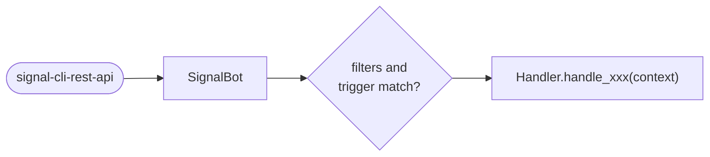
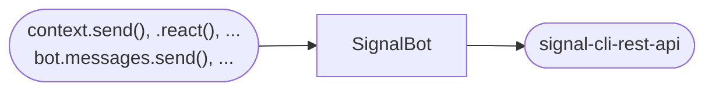
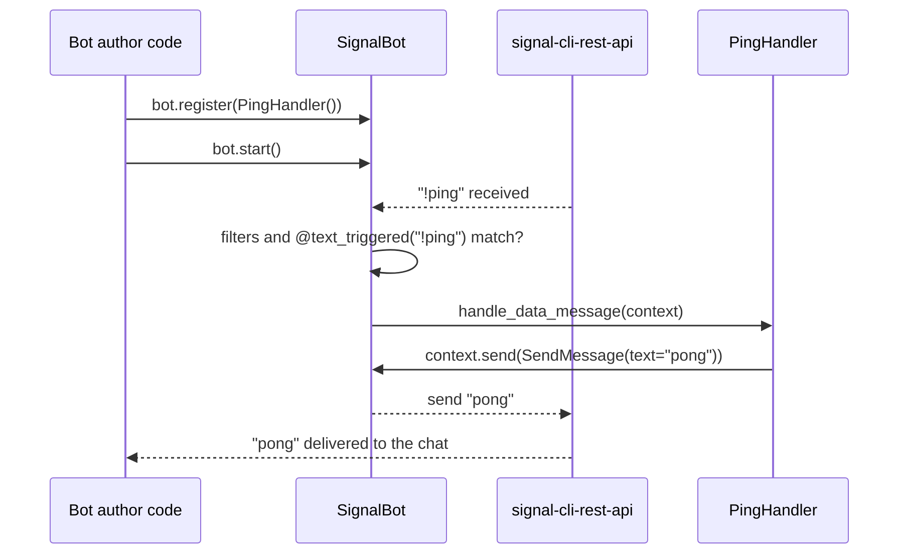

Signalbot moves messages in two directions: **incoming** messages arrive from
`signal-cli-rest-api` and are routed to the handlers you registered, **outgoing** messages are sent
by your code back through `signal-cli-rest-api`. This page shows how the pieces fit together from
the point of view of a bot author. The internals are described in
[Architecture](contributing/01_architecture.md).

## Message flow

### Incoming



### Outgoing



- **Incoming**: every message the bot's account receives is turned into a typed message object
  (a [`ReceivedMessage`][signalbot.messages.ReceivedMessage]), checked against the filters and
  trigger of each registered handler, and passed to every matching handler wrapped in a
  [`Context`][signalbot.context.Context].
- **Outgoing**: the methods on `context` (`context.send(...)`, `context.react(...)`, ...) answer
  the message the handler received, so the recipient is filled in for you. The same actions are
  available on the bot itself (`bot.messages`, `bot.reactions`, `bot.polls`, ...) when you need to
  pass the recipient explicitly, e.g. from a scheduled job.

## Message types

Each kind of incoming message has its own handler base class. Subclass it, implement its handler
method, and that method receives the matching context:

| Message                                                                                                      | Handler                                                         | Context                                                        | Handler method         |
| ------------------------------------------------------------------------------------------------------------ | --------------------------------------------------------------- | -------------------------------------------------------------- | ---------------------- |
| [`DataMessage`][signalbot.messages.DataMessage], [`EditMessage`][signalbot.messages.EditMessage] | [`DataMessageHandler`][signalbot.handlers.DataMessageHandler]   | [`DataMessageContext`][signalbot.context.DataMessageContext]   | `handle_data_message`  |
| [`Reaction`][signalbot.reactions.Reaction]                                                                   | [`ReactionHandler`][signalbot.handlers.ReactionHandler]         | [`ReactionContext`][signalbot.context.ReactionContext]         | `handle_reaction`      |
| [`RemoteDelete`][signalbot.messages.RemoteDelete]                                                            | [`RemoteDeleteHandler`][signalbot.handlers.RemoteDeleteHandler] | [`RemoteDeleteContext`][signalbot.context.RemoteDeleteContext] | `handle_remote_delete` |
| [`TypingMessage`][signalbot.messages.TypingMessage]                                                          | [`TypingHandler`][signalbot.handlers.TypingHandler]             | [`TypingContext`][signalbot.context.TypingContext]             | `handle_typing`        |
| [`GroupUpdate`][signalbot.groups.GroupUpdate]                                                                | [`GroupUpdateHandler`][signalbot.handlers.GroupUpdateHandler]   | [`GroupUpdateContext`][signalbot.context.GroupUpdateContext]   | `handle_group_update`  |

A [`ReadyHandler`][signalbot.handlers.ReadyHandler] doesn't handle messages: its `handle_ready`
runs once, after the bot has connected and before it starts processing incoming messages.

## Registration

Handlers need to be registered with the bot — typically once at startup,
e.g. `bot.register(PingHandler())`. The `bot.register()` just stores the handler and its filters;
nothing is invoked yet. From then on, every incoming message is checked against each registered
handler's filters and trigger decorator (`@text_triggered`, `@regex_triggered`,
`@reaction_triggered`), and every handler that matches is invoked with a fresh `Context`.

### Exclusive handlers

By default every matching handler runs, so a handler without a trigger also sees the messages
another handler already answered. Registering handlers with a `priority` makes them exclusive: of
the exclusive handlers that match a message, only the one with the highest priority runs, the first
registered one on ties. Handlers without a priority still run alongside it.

```python
# not exclusive: every message
bot.register(Handler1())

# exclusive: if Handler2 and Handler3 match, only Handler2 runs
bot.register(Handler2(), priority=1)

# exclusive: only runs if Handler2 does not match
bot.register(Handler3(), priority=0)
```

See the [handler priorities example](examples/05_priority_bot.md) for a complete bot.

## Following one message end to end

Take a bot with a single handler:

```python
class PingHandler(DataMessageHandler):
    @text_triggered("!ping")
    async def handle_data_message(self, context: DataMessageContext) -> None:
        await context.send(SendMessage(text="pong"))
```



This walk-through uses a `DataMessage` because it's the most common case, but reactions, typing
indicators, remote deletes, and group updates all follow the same shape with their own handler and
context from the [table above](#message-types).
