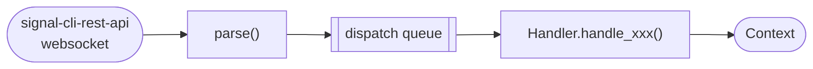
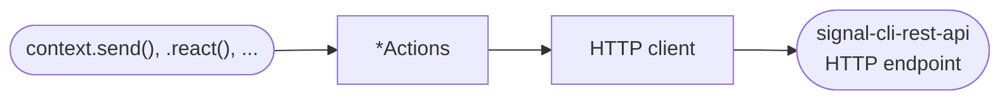
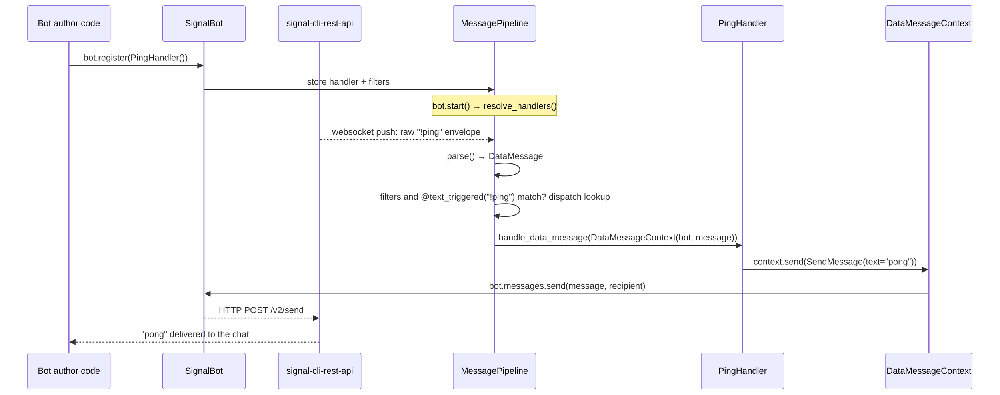

This page describes the internals of signalbot: the layers a message passes through in each
direction and the conventions that keep them consistent. Read it before
[adding a new incoming message](02_incoming_messages.md) or
[a new outgoing message](03_outgoing_messages.md). For the user-facing picture, see
[How it works](../02_concepts.md).

Only what `src/signalbot/__init__.py` exports in `__all__`, plus the public types of each domain
package (`messages/`, `groups/`, `polls/`, `reactions/`, `receipts/`, `contacts/`, `attachments/`,
`context/`), is public API. Modules and packages with a leading underscore (`_pipeline.py`,
`_actions/`, `_client/`, `_generated/`, ...) are internal.

## Message flow

### Incoming

`MessagePipeline._produce` in
[`_pipeline.py`](https://github.com/signalbot-org/signalbot/blob/main/src/signalbot/_pipeline.py)
reads the raw JSON from the websocket, and
[`parse()`][signalbot.messages.parse] turns it into a typed
[`ReceivedMessage`][signalbot.messages.ReceivedMessage]. `_dispatch_to_handlers` looks up the
message type in `_MESSAGE_DISPATCH`, picks the registered handlers whose filters and trigger match,
and queues each handler method bound to a fresh `Context`. `MessagePipeline._consume` pulls the jobs
from the queue and runs them.

### Outgoing

A [`Context`][signalbot.context.Context] method delegates to one of the `*Actions` classes on the
bot (`bot.messages`, `bot.reactions`, `bot.polls`, ...), which resolves the recipient, builds the
generated wire request and calls the internal HTTP client (`SignalAPI`) that sends it to
`signal-cli-rest-api`.

## Layers

Roughly innermost to outermost:

1. **Generated models** —
   [`src/signalbot/_generated/`](https://github.com/signalbot-org/signalbot/tree/main/src/signalbot/_generated)
   holds pydantic models generated from signal-cli-rest-api's swagger schema: `_generated/api`
   for requests, `_generated/data` for responses and `_generated/receive` for incoming
   messages. They are never edited by hand, see
   [New signal-cli-rest-api version](04_new_signal_cli_rest_api.md#generated-models).
2. **Domain packages** — `messages/`, `groups/`, `polls/`, `reactions/`, `receipts/`,
   `contacts/` and `attachments/` hold the public types: the parsed incoming messages, the request
   models bot authors construct, and thin wrappers around the generated types they expose (see
   [Generated models](04_new_signal_cli_rest_api.md#generated-models)).
   [`messages/parser.py`](https://github.com/signalbot-org/signalbot/blob/main/src/signalbot/messages/parser.py)
   turns a raw envelope into one of the incoming message types.
3. **HTTP client** —
   [`src/signalbot/_client/`](https://github.com/signalbot-org/signalbot/tree/main/src/signalbot/_client)
   has one file per API section (`messages.py`, `groups.py`, `polls.py`, ...), each with a `*URIs`
   class for the endpoint paths and a `*Client` class that takes generated request models,
   serializes them and calls `self._request(...)`. They are all attached to `SignalAPI` in
   [`signal_api.py`](https://github.com/signalbot-org/signalbot/blob/main/src/signalbot/_client/signal_api.py).
4. **Actions** —
   [`src/signalbot/_actions/`](https://github.com/signalbot-org/signalbot/tree/main/src/signalbot/_actions)
   has one `*Actions` class per API section (`MessageActions`, `PollActions`, ...). Each resolves
   recipients through `RecipientResolver`
   ([`_recipients.py`](https://github.com/signalbot-org/signalbot/blob/main/src/signalbot/_recipients.py)),
   converts the domain request to the generated one, calls the client, logs, and returns a
   domain-level result. `SignalBot._init_actions()` in
   [`bot.py`](https://github.com/signalbot-org/signalbot/blob/main/src/signalbot/bot.py) attaches
   them as `bot.messages`, `bot.polls`, ... `GroupActions` is the exception: it is nested at
   `bot.groups.actions` because `bot.groups` is already the
   [`GroupRegistry`][signalbot.groups.GroupRegistry] cache.
5. **Contexts** —
   [`src/signalbot/context/`](https://github.com/signalbot-org/signalbot/tree/main/src/signalbot/context)
   has one `*Context` class per incoming message type. It wraps the bot and the received message,
   and its convenience methods (`context.send(...)`, `context.react(...)`, ...) delegate to the
   Actions layer, filling in what is only known once a message has been received, such as the
   recipient.
6. **Handlers** —
   [`src/signalbot/handlers.py`](https://github.com/signalbot-org/signalbot/blob/main/src/signalbot/handlers.py)
   has one `*Handler` ABC per incoming message type with a single abstract `handle_xxx(self, context)`
   method, plus the trigger decorators (`text_triggered`, `regex_triggered`, `reaction_triggered`).
   Each decorator stores its message predicate on the wrapper, which the pipeline checks at
   dispatch time.
7. **Pipeline** —
   [`src/signalbot/_pipeline.py`](https://github.com/signalbot-org/signalbot/blob/main/src/signalbot/_pipeline.py)
   owns handler registration and dispatch. `_MESSAGE_DISPATCH` is the single map from a parsed
   message type to `(HandlerABC, ContextClass, "handle_xxx")`; nothing reaches a handler without an
   entry there.
8. **Bot** — [`SignalBot`][signalbot.bot.SignalBot] in
   [`bot.py`](https://github.com/signalbot-org/signalbot/blob/main/src/signalbot/bot.py) is the
   object bot authors construct.
   [`_bot_init.py`](https://github.com/signalbot-org/signalbot/blob/main/src/signalbot/_bot_init.py)
   builds the shared `SignalAPI` client, event loop, scheduler and storage backend, and
   `SignalBot._init_actions()` wires up the `*Actions` instances and the `MessagePipeline`.

## Runtime

`SignalBot.start()` schedules `_async_post_init` and runs the event loop. `_async_init` checks that
`signal-cli-rest-api` is reachable and has a compatible version and mode, refreshes the group cache,
resolves the group names of the registered handlers to ids and runs the
[`ReadyHandler`][signalbot.handlers.ReadyHandler]s. Then the pipeline starts one producer task,
which reads the websocket, parses and queues the matching handlers, and three consumer tasks, which
pull from the queue and run the handlers. Both loops are wrapped in `rerun_on_exception`
([`_utils/retry.py`](https://github.com/signalbot-org/signalbot/blob/main/src/signalbot/_utils/retry.py)),
so an uncaught exception restarts the loop instead of killing the bot.

## Following one message end to end

The `PingHandler` from [How it works](../02_concepts.md#following-one-message-end-to-end), with the
internal classes it passes through:

